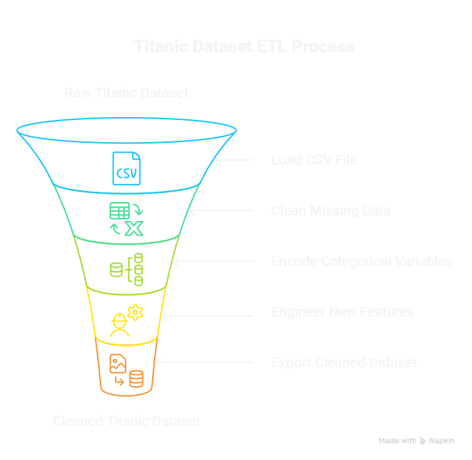

# 🛳 Titanic Dataset ETL Pipeline(TASK 1)

This project demonstrates an end-to-end ETL (Extract, Transform, Load) pipeline using the classic Titanic dataset. The goal is to prepare the data for further analysis and modeling by cleaning missing values, encoding categorical variables, and engineering new features.

---
## 🖼️ ETL Process Diagram



---
## 📂 Dataset

- **Source:** [Kaggle - Titanic Dataset](https://www.kaggle.com/datasets/yasserh/titanic-dataset)
- **File Used:** `Titanic-Dataset.csv`

---

## 🔄 ETL Pipeline Overview

Load CSV → Clean Missing Data → Encode Categorical Variables → Engineer Features → Export Cleaned Dataset


### Key Steps:

- Fill missing values (`Age`, `Embarked`, `Cabin`)
- Drop irrelevant column (`Ticket`)
- Label encode categorical variables (`Sex`, `Embarked`)
- Engineer new features: 
  - `FamilySize` = `SibSp` + `Parch` + 1
  - `IsAlone` (1 if traveling alone, else 0)
  - `Title` extracted from `Name` and label encoded

---

## 🛠️ Setup Instructions

### 1. Clone or Download the Repository
```bash
git clone https://github.com/your-username/titanic-etl.git
cd titanic-etl
---
### 2. Install Required Packages:
Ensure you have Python 3.x installed. Then install dependencies:

pip install pandas scikit-learn

## ▶️ How to Run
Run in Jupyter Notebook:
Open Titanic_ETL_Notebook.ipynb in Jupyter and run all cells.

Or run Python script:
python titanic_et1.py --input Titanic-Dataset.csv --output cleaned_titanic_data.csv

📁 Output
Cleaned data saved as cleaned_titanic_data.csv

Logs printed in terminal for every ETL step

👩‍💻 Author
Laksha Mandiye
Data Science Intern @ TechNest
LinkedIn | GitHub

🙏 Acknowledgments
Titanic dataset by Kaggle

Assistance from Julius AI, Napkin AI, NotebookLM, and ChatGPT
---


📰 Fake News Detection Using NLP and Deep Learning(TASK 2)

📌 Project Summary
In the era of rapid digital communication, fake news has emerged as a serious threat to public trust and social stability. This project presents a deep learning-based NLP solution for automatically detecting fake news articles using real-world datasets.

---
🚀 What This Project Does
This project classifies news articles as real or fake using natural language processing techniques and neural networks. It utilizes labeled datasets containing genuine and fabricated news and builds a robust, interpretable model to distinguish between the two with high accuracy.


---
⚙️ How It Works
Data Preprocessing:

Datasets (True.csv, Fake.csv) are cleaned, merged, and labeled.

Text data is constructed by combining the article's title and content.

Feature Engineering:

Word embeddings (e.g., TF-IDF, GloVe, or BERT-based embeddings).

Sentiment scores and contextual metadata (optional in advanced versions).

Model Architecture:

Baseline: LSTM/GRU or Dense Neural Networks.

Advanced: Transformer-based models like BERT or RoBERTa.

Ensemble techniques may be used to combine outputs from multiple architectures.

Training:

Supervised learning using binary cross-entropy loss.

Split into training and validation sets, optionally cross-validated.

Optional: Adversarial training, contrastive learning, or meta-learning.

Evaluation:

Confusion Matrix, ROC-AUC curve, classification report.

Attention heatmaps and SHAP/LIME visualizations for interpretability.

---
🧠 Core Logic
The model learns patterns in language, semantics, and tone that are statistically correlated with either truthful or fabricated content. It focuses on:

Lexical and contextual patterns (e.g., exaggerations, bias).

Sentence structure and information density.

Semantic coherence and topic consistency.

By training on these signals, the model generalizes to identify new, unseen news articles as likely real or fake.

---
✨ Project Features
✅ Clean, labeled dataset integration

📊 Visual Exploratory Analysis:

Word clouds for fake vs real articles

Confusion matrix and ROC curve

🤖 Customizable model pipeline: Swap in different model architectures

🔍 Interpretability tools (e.g., attention heatmaps, SHAP, LIME)

🧠 Advanced ideas implemented:

Ensemble methods

Adversarial sample resistance

Knowledge graph support (optional)

🌐 Ready for deployment or research extension


